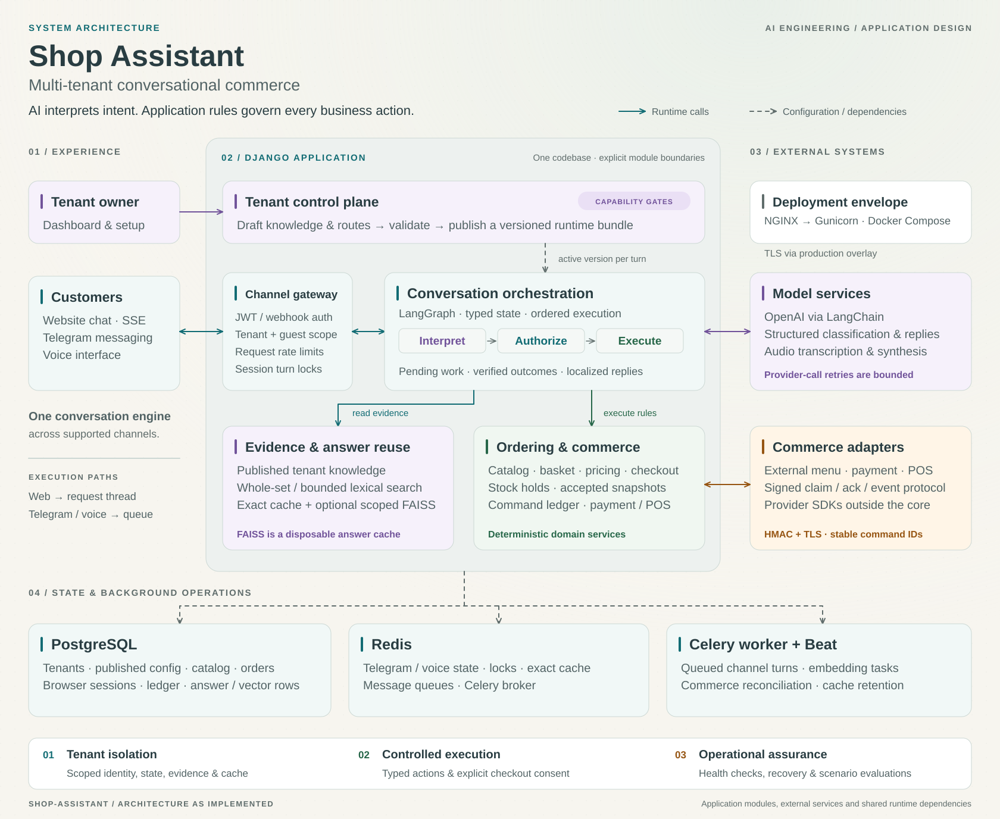

# Shop Assistant

A self-hosted AI ordering assistant for cafés and restaurants, built with Python,
Django, and LangGraph.

Help customers explore your menu, ask questions, customize their basket, and
complete a configured checkout through conversation.

Built for **developers and agencies creating restaurant chatbots**.

## What it offers

- **Menu answers:** help customers explore dishes, prices, and restaurant information.
- **Ordering through chat:** choose items, customize a basket, and follow a configured checkout.
- **Multilingual replies:** answer customers in their own language.
- **Text and voice:** serve customers through website chat, Telegram, and voice.
- **Separate restaurant workspaces:** manage each restaurant's menu, knowledge, and settings.
- **Commerce connections:** integrate external menus, payments, and POS systems through adapters.
- **A local playground:** get started with Docker, sample café data, and payment/POS simulators.

## Architecture

A tenant-aware Django application uses LangGraph to interpret requests and manage
conversation state. Application services authorize actions and enforce catalog,
pricing, inventory, and checkout rules. External commerce adapters connect through
a signed protocol.

[](docs/assets/shop-assistant-architecture.svg)

[View system diagram](docs/assets/shop-assistant-architecture.svg) ·
[View AI conversation flow](docs/assets/conversation-flow.svg) ·
[Download architecture PNG](docs/assets/shop-assistant-architecture.png)

Explore the [architecture and conversation flow](docs/architecture.md) for runtime
boundaries, design decisions, and links to the implementation.

## Local quick setup

Install **Docker with Compose v2** and **Python 3.10+**, then run:

```sh
git clone https://github.com/kshitij1489/shop-assistant.git
cd shop-assistant
python3 scripts/setup.py
```

The guide generates secrets, starts the local app and mock services, and creates
a sample café. Enter an OpenAI API key for chat, or skip it to explore the
dashboard. The first build downloads dependencies and models.

- **Dashboard:** http://localhost:8080/accounts/login/ — user `demo-owner`.
- **Password:** the one you entered, or `DEMO_OWNER_PASSWORD` in `.env.demo`.
- **Chat:** http://localhost:8080/chat-page/?tenant=demo-cafe — try “What is on the menu?”

The sample café answers menu and restaurant questions and supports cash checkout
in INR. Pickup, dine-in, and delivery to postal code 560001 are enabled; external
payment and POS integrations are disabled. See the
[local setup guide](docs/operations/development.md) for hours, fees, and stock.
Reseeding preserves existing demo settings and stock. Next, choose a path:

**A. Run the end-to-end demo with mock services**

```sh
python3 scripts/setup.py demo --allow-live-chat
```

Runs the existing smoke evaluation with synthetic tenants and simulated commerce,
then generates a report. Model calls use your API key and incur API usage;
payment/POS services are mocked. See [evaluation](docs/evaluate/integration.md).

**B. Deploy to production** — on your VPS, first follow the
[production guide](docs/operations/production.md) to set up DNS, free ports 80/443,
and create a TLS certificate. Then run:

```sh
python3 scripts/setup.py production --check
python3 scripts/setup.py production
```

The guide starts with `production --configure-only` to generate settings.
`--check` checks existing configuration, port conflicts, certificate validity and
DNS without changing services. Deployment verifies local and public HTTPS before
reporting success, records progress in `setup.log`, and offers to create your
administrator account in the same terminal. Existing active administrators are
detected on reruns. Production uses separate
configuration and volumes, without demo data or mock services. The guide also
covers certificate renewal, the operator account and troubleshooting.

## Documentation

| Goal | Doc |
| --- | --- |
| Architecture, diagrams, and design decisions | [docs/architecture.md](docs/architecture.md) |
| Install and run locally | [docs/operations/development.md](docs/operations/development.md) |
| Production and HTTPS | [docs/operations/production.md](docs/operations/production.md) |
| Tests | [docs/operations/testing.md](docs/operations/testing.md) |
| Release notes | [CHANGELOG.md](CHANGELOG.md) |
| Documentation index | [docs/README.md](docs/README.md) |

## Product scope

Tenants supply knowledge, menu, checkout policy, and channel credentials.

Bookings, retail, and general non-café workflows are not supported. Adding a
business workflow beyond the café package requires Python changes. Uploaded
prompts configure café answers and existing routes only.

**Commerce limits (read before live orders):** one checkout location per tenant;
one active connection per role/location; cash or one online payment attempt per
order; exact full capture before expiry; no split tenders/partial captures/gift
cards/tips/FX. See [operator recovery](docs/commerce/operations.md).

Menus: one local catalog in `orders` tables. **Menu → Menu source** chooses Local
or External. See [menu adapter](docs/commerce/menu_adapter.md) and
[commerce integration](docs/commerce/integration.md).

## Further improvements

Planned work beyond the current café package:

1. **Smarter knowledge injection.** Chunk tenant knowledge and retrieve the
   relevant passages by embedding similarity, so answers use the matching
   context instead of a single bulk prompt.
2. **Dashboard tool control.** Let operators add and remove chatbot tools from
   the UI dashboard, so each tenant can customize the available actions without
   a code change.
3. **Broader business support.** Extend the product past cafés to general
   shop, studio, and retail workflows, while keeping the current café ordering
   path intact.

## License

[MIT](LICENSE).
