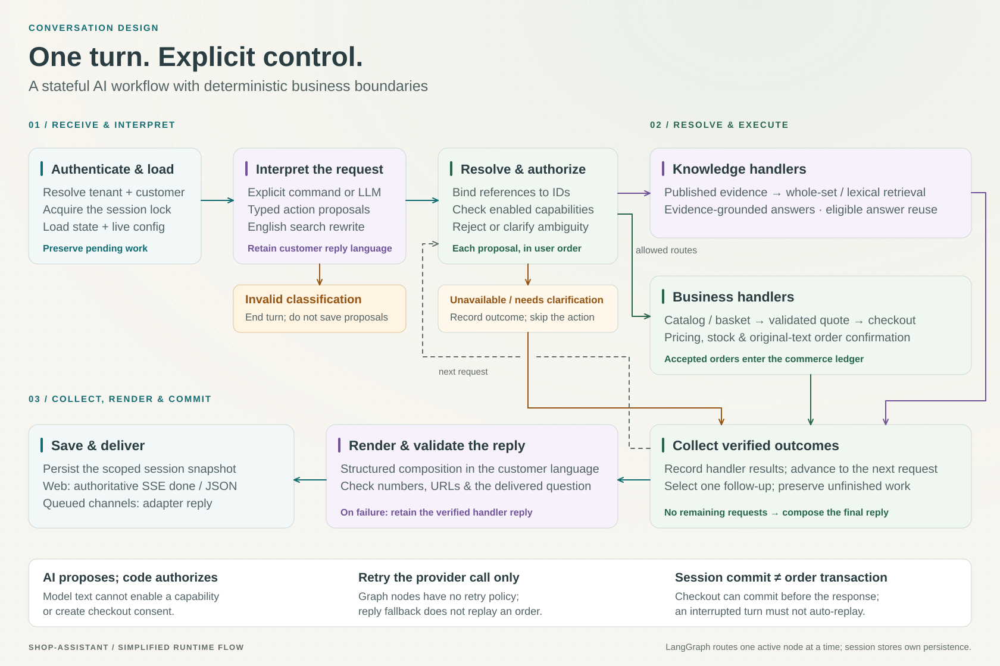
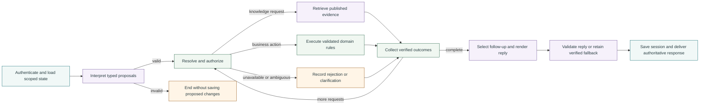

# Architecture

Shop Assistant is a self-hosted, multi-tenant café ordering application. Its
architecture separates language interpretation, conversation orchestration,
business rules, and external commerce integration. Django modules share one
codebase and database; Gunicorn serves HTTP, while Celery processes background
work. LangGraph runs inside the application and workers.

These diagrams describe the current implementation. The boxes inside the Django
boundary are logical modules, not separately deployed services.

## System overview

[Open SVG](assets/shop-assistant-architecture.svg) · [Download PNG](assets/shop-assistant-architecture.png)

Solid arrows show calls or exchanges; dashed arrows show configuration or runtime
dependencies. Colors distinguish AI and knowledge (violet), business execution
(green), commerce integration (amber), and application flow (teal). The bottom
dependency bus groups services used by the application; it does not imply that
every request runs a background job.

NGINX fronts Gunicorn in Docker Compose, with a separate production TLS overlay.
The deployment card describes this hosting envelope. Model APIs and commerce
adapter applications sit outside the Django process boundary.

## A conversation turn

[Open SVG](assets/conversation-flow.svg) · [Download PNG](assets/conversation-flow.png)

1. **Establish identity and state.** Website chat validates a tenant JWT and uses
   a server-side guest identity. Telegram and voice ingress enqueue scoped
   messages for Celery. A turn loads its session and the tenant's active published
   configuration under the appropriate session lock.
2. **Interpret the request.** Explicit commands or structured model output produce
   classifications, action proposals, a search rewrite, and the response language.
   Invalid model output ends classification without saving proposed changes.
3. **Resolve and authorize.** The workflow binds proposals to concrete references,
   checks enabled capabilities, and handles pending tasks. Disabled, rejected, or
   ambiguous requests produce outcomes instead of executing their proposed action.
4. **Execute application rules.** Knowledge handlers use published evidence.
   Business handlers enforce catalog, basket, pricing, stock, and checkout rules.
   Requests execute in the customer's order; unresolved work can survive a detour.
5. **Compose a verified response.** The graph collects outcomes and selects a
   follow-up. A structured renderer localizes the reply and validates its numbers,
   URLs, and delivered question. A rendering failure preserves the verified
   handler reply without repeating the business operation.
6. **Publish session state and deliver.** The session store saves the turn.
   Website streaming finishes with an authoritative `done` event after commit;
   JSON and queued channel adapters deliver through their respective paths.

This is a simplified flow. Cancellation, task matching, and checkout recovery
have additional branches in the [graph](../chatbot_core/logic/cafe/workflow/graph.py)
and [runner](../chatbot_core/logic/cafe/workflow/runner.py).

The turn is **not one database transaction**. Checkout operations can commit
before session publication or response delivery. A failed connection must not
automatically replay the request. Graph nodes have no retry policy or LangGraph
checkpointer; the session stores own persistence, and bounded model-provider
retries do not replay business operations.

## Architectural decisions

| Decision | Implementation and purpose |
| --- | --- |
| Separate model proposals from business authority | Typed classifications feed a resolver and capability checks. Python handlers determine business outcomes; the reply renderer cannot execute actions or grant permissions. Checkout consent must come from the original customer text. |
| Publish tenant configuration explicitly | Knowledge and routing documents remain drafts until validated and published atomically. Each turn reads an active version; an invalid publication preserves the previous bundle. Current catalog prices and checkout settings are checked by their own services. |
| Scope state across channels | Identity includes tenant, channel, and user. Website conversation state lives in Django's PostgreSQL session backend, with browser advisory locks. Telegram and voice state use Redis snapshots and renewable locks. |
| Separate retrieval from answer reuse | Small published knowledge sets are supplied whole; larger sets use bounded lexical retrieval. FAISS indexes cached answer vectors within scoped partitions. Semantic reuse is disabled by default and limited to eligible public knowledge topics. |
| Keep commerce behind an adapter contract | The core owns accepted order snapshots, stock reservations, command records, and payment/POS state. External applications own provider SDKs and onboarding. HMAC signatures, stable identifiers, leases, acknowledgements, and events support delivery and reconciliation. |
| Use explicit consistency boundaries | PostgreSQL owns durable business records and cache answer/vector pairs. Redis accelerates exact cache reads and provides channel state and queues. FAISS snapshots are disposable and local to each process. There is no global SQL/Redis/provider transaction. |
| Separate interactive and background work | Website turns run in the HTTP request path. Telegram/voice turns run through Celery. Beat schedules commerce reconciliation and cache retention; queues also support embedding tasks. |
| Make correctness inspectable | Tests cover tenant isolation, conversation transitions, checkout, commerce, and protected tenant deletion. The evaluation harness records scenario evidence; readiness checks verify PostgreSQL and Redis without calling model providers. |

## Implementation map

| Boundary | Source | Design detail |
| --- | --- | --- |
| Deployment and ingress | [Compose](../docker-compose.yml), [TLS overlay](../docker-compose.tls.yml), [NGINX](../nginx/default.conf) | Shared application image for web, worker, scheduler, and initialization |
| Channel entry points | [Website](../chatbot_core/channels/website.py), [Telegram](../chatbot_core/channels/telegram_webhook.py), [Voice](../chatbot_core/channels/voice_assistant.py), [queued processor](../chatbot_core/processor.py) | Direct browser turns and asynchronous channel processing |
| Tenant publication | [Runtime configuration](../chatbot_core/runtime_configuration.py), [capabilities](../chatbot_core/capabilities.py) | Validated publication and per-turn capability checks |
| Conversation orchestration | [Graph](../chatbot_core/logic/cafe/workflow/graph.py), [runner](../chatbot_core/logic/cafe/workflow/runner.py), [action resolver](../chatbot_core/logic/action_resolver.py) | Typed state, proposal resolution, ordered execution, pending tasks |
| Models and reply validation | [Model wrappers](../chatbot_core/llm/models.py), [schemas](../chatbot_core/llm/schemas.py), [reply renderer](../chatbot_core/logic/cafe/reply_renderer.py) | Structured interpretation and outcome-based composition |
| Evidence and caching | [Knowledge retrieval](../chatbot_core/knowledge_retrieval.py), [semantic cache](../chatbot_core/vector_store/semantic_cache.py), [FAISS snapshots](../chatbot_core/vector_store/faiss_index.py) | Published evidence, scoped answer reuse, bounded retention |
| Session consistency | [Django session store](../chatbot_core/logic/cafe/session/django.py), [browser lock](../chatbot_core/logic/cafe/session/browser_lock.py), [Redis session store](../chatbot_core/logic/cafe/session/redis_session.py) | Channel-specific persistence and turn serialization |
| Business execution | [Checkout](../chatbot_core/logic/cafe/checkout.py), [catalog](../chatbot_core/logic/cafe/catalog.py), [pricing](../orders/pricing.py), [commerce services](../commerce/services.py) | Authoritative prices, order acceptance, stock reservations |
| External adapter protocol | [Commerce API](../commerce/api.py), [events](../commerce/events.py), [command queue](../commerce/queue.py), [menu sync](../commerce/menu_sync.py) | Signed adapter requests, reconciliation, external menu authority |
| Operations and assurance | [Tasks](../chatbot_core/tasks.py), [readiness](../studio_desk/health.py), [tenant deletion](../users/tenant_deletion.py), [tests](../tests/README.md), [evaluation](evaluate/integration.md) | Scheduled maintenance, dependency checks, protected records, scenario evidence |

## Editable flow source

The SVGs are editable vector assets with embedded text, accessible descriptions,
and no external fonts or images. PNG copies are provided for slides and portfolio
sharing. The Mermaid below is a compact alternative for editing the flow in text;
the styled SVGs are maintained separately.

## Current boundaries

The supported workflow is café ordering. Tenant uploads configure existing
routes; new business workflows require Python changes. External adapters require
provider-specific implementation and onboarding; the repository includes local
simulators, not certified payment or POS clients. Commerce currently uses one
checkout location per tenant, cash or one online payment attempt per order, and
exact full capture before expiry for online fulfillment.

See [runtime configuration](chatbot/runtime_configuration.md),
[model and streaming behavior](chatbot/llm.md),
[answer caching](chatbot/semantic_cache.md), and the
[commerce contract](commerce/integration.md) for the detailed guarantees and
limits. Embedding-based knowledge retrieval and broader business workflows remain
future work; they are not represented as implemented services in these diagrams.
