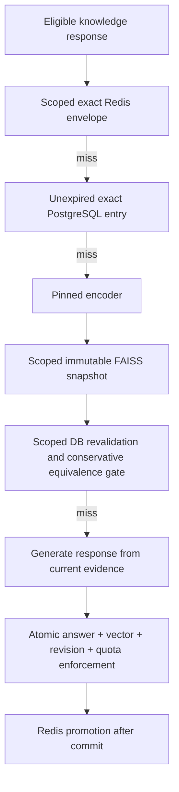

# Bounded FAISS answer cache

FAISS caches generated answers; it does not replace the knowledge retriever or
store the source of truth. PostgreSQL owns answer/vector pairs and their expiry.
Redis accelerates exact hits. Each process builds disposable, scoped FAISS
snapshots on demand. Application startup never reconstructs this cache.

## Scope and live integration

`vector_store/semantic_cache.py` is the single admission and lookup service.
The older `answer_from_knowledge` API delegates to it. The active
`generate_response_from_knowledge` path uses it when `SEMANTIC_CACHE_ENABLED=true`
for stateless public café topics: brand story, amenities, events/tours, team/policy,
and general brand information. Hours, menu/stock, allergy advice, ordering,
customer records, and responses depending on conversation history are excluded
from this live integration. Their existing retrieval and exact-cache paths remain.



A partition hashes the caller's tenant/user/channel/intent scope, prompt system
version, generation model, knowledge fingerprint and embedding fingerprint.
The live path fingerprints the complete effective system prompt, evidence identity,
rewrite, response language and generation parameters. The legacy helper includes
the published configuration version and optional customer/channel in its scope.
Evaluation namespaces and cold-cache bypasses apply to all tiers.

Filtering happens **before** nearest-neighbour selection. Retrieved IDs are checked
again against the same partition and an unexpired DB row before any answer is used.
Six closer vectors belonging to another tenant cannot hide the eligible match.

Cosine similarity is only a candidate signal. Default reuse additionally requires
the same ordered words, numbers and internal punctuation; case, whitespace, final
sentence punctuation and an outer English “please” can differ. Signs, decimals,
ranges, negations, item names, language and argument order stay significant.
Broad paraphrase reuse requires a separately evaluated equivalence verifier; the
implementation deliberately makes no general semantic-equivalence claim.

## Consistency and lifecycle

- Answer and little-endian float32 vector are written in one transaction. A unique
  `(partition, sig)` constraint protects concurrent requests. Retrying also repairs
  a missing vector. Every Redis publication waits for the outer transaction to
  commit, including lookup promotions and exact-only fallback writes. Promotion
  rechecks the original deadline at commit time; rollback discards the callback.
- A singleton PostgreSQL row serializes cache admissions/pruning, enforcing global
  row and logical-byte limits across web and Celery processes. It also holds a
  committed revision. Every semantic search checks that revision on the primary DB;
  a worker refreshes its local snapshot when another worker writes or prunes.
- Builds check the revision again before publishing. A concurrent commit causes a
  retry; repeated contention gives a cache miss. No process incrementally mutates
  a published index. Search results and IDs always use the same snapshot.
  Searches inside a caller's transaction use temporary snapshots: uncommitted
  vectors must not survive rollback in a process-local index, because a later
  transaction can reuse the rolled-back revision number. Normal autocommit
  searches retain and reuse snapshots.
- One process lock covers builds, searches, ID translation and local LRU eviction.
  This intentionally bounds concurrent build memory and avoids FAISS search/add
  races. Snapshots retain vectors/IDs only, not answer text or ORM objects.
- Each entry has an absolute deadline, capped by `SEMANTIC_CACHE_MAX_TTL`.
  Neither a semantic hit nor Redis promotion extends it. Expired rows never qualify,
  even if cleanup has not run. Redis envelopes validate their deadline too.
- Admissions prune expired/legacy rows and evict least recently used entries to
  satisfy partition, global row and logical-byte budgets. Exact Redis, durable exact
  and semantic hits update durable access counters atomically without extending TTL.
- Celery Beat runs `chatbot_core.prune_semantic_cache` every five minutes, including
  when semantic reuse is disabled. The job also applies lowered partition limits.
  Expired rows cannot accumulate indefinitely when the scheduler is running;
  admissions independently enforce budgets when it is not.
- Cache, encoder or index failures fall back to generating an answer. Failed writes
  preserve the successfully generated response. Database reads and optional LRU
  updates use transaction boundaries/savepoints so a cache SQL error does not
  leave the caller's transaction unusable. Invalid policy settings are
  configuration errors and should be fixed before enabling the feature.

`chatbot_core.rebuild_faiss` is retained for old task callers. It now prunes and
increments the shared revision, so every worker refreshes lazily. There is no
index-file persistence, shared FAISS volume or trusted pickle/index-file input.
The unused Compose volume was removed. Any existing `FAISS_INDEX_PATH` is ignored.

## Resource defaults

| Setting | Default | Meaning |
| --- | ---: | --- |
| `SEMANTIC_CACHE_ENABLED` | `false` | Explicit rollout gate for durable/semantic reuse |
| `SEMANTIC_CACHE_MAX_ROWS` | 10,000 | Global durable answer/vector pairs |
| `SEMANTIC_CACHE_MAX_PARTITION_ROWS` | 512 | Entries within one eligible scope/version |
| `SEMANTIC_CACHE_MAX_DB_BYTES` | 64 MiB | Logical payload budget across durable entries |
| `SEMANTIC_CACHE_MAX_INDEX_BYTES` | 32 MiB | Estimated FAISS snapshot/build budget per process |
| `SEMANTIC_CACHE_MAX_INDEXES` | 64 | Process-local LRU partition count |
| `SEMANTIC_CACHE_MAX_TTL` | 1,800 seconds | Maximum absolute answer lifetime |
| `SEMANTIC_CACHE_MAX_QUERY_BYTES` | 4,096 | Maximum normalized UTF-8 query size |
| `SEMANTIC_CACHE_MAX_RESPONSE_BYTES` | 16,384 | Maximum admitted UTF-8 response size |
| `SEMANTIC_CACHE_SIMILARITY` | 0.98 | Minimum cosine candidate score |

The default encoder is `sentence-transformers/all-MiniLM-L6-v2`, dimension 384,
pinned to commit `1110a243fdf4706b3f48f1d95db1a4f5529b4d41`. The encoder fingerprint
includes model, immutable revision, dimension and normalization format. Changing
any of them creates new partitions even when dimensions are identical. Set all
three `EMBEDDING_MODEL`, `EMBEDDING_REVISION` and `EMBEDDING_DIMENSION` for a custom
encoder, and restart workers. Revisions must be full model commit hashes; custom
code loading is disabled. The model loads once on first use, under a lock, and its
reported dimension must match. Do not assume the default English encoder gives
good multilingual recall; evaluate a pinned multilingual encoder if needed.

FAISS uses normalized `IndexFlatIP` for exact cosine search within small, capped
partitions. At 512 vectors, an approximate index would add training/tuning and
recall tradeoffs without evidence of a benefit. No arbitrary dimension is accepted:
the configured dimension must be positive and at most 4096; zero/non-finite vectors
and malformed byte lengths are rejected.

The snapshot budget estimates vector storage, native allocation growth, IDs,
objects and one streamed build batch. Oversized partitions bypass indexing. This
is an **allocation estimate**, not a hard process RSS ceiling: the encoder, Python
allocator, native libraries and application memory are separate. Multiply retained
snapshot/model budgets by the number of processes. The DB byte budget includes
UTF-8 query/answer bytes, vector bytes and an overhead allowance; it does not bound
PostgreSQL indexes, WAL or table bloat. Keep normal autovacuum and disk monitoring.
Redis queue/session/cache memory remains a separate operational concern; use a
dedicated bounded cache deployment if a hard cache Redis ceiling is required.

## Deploy and operate

1. Stop old application/Celery workers for the schema transition. Apply
   `python manage.py migrate`. Old cache rows lack a trustworthy encoder version
   and are excluded immediately; they are cleaned by pruning rather than guessed
   or re-embedded. Duplicate old signatures do not block the conditional constraint.
2. Run `python manage.py semantic_cache --prune`, then start the new workers and
   Beat. Existing customer/order/knowledge data is unaffected. A large legacy cache
   should be pruned during this transition, outside request traffic.
3. Pre-download the pinned encoder into `HF_HOME` as part of the image/cache setup
   if serving first-use downloads is undesirable. Keep semantic reuse disabled
   while measuring workload relevance and false-reuse rates in staging.
4. Enable `SEMANTIC_CACHE_ENABLED=true` and restart processes when ready. Disable
   it and restart to return to exact-only behavior; no source data needs rebuilding.

`python manage.py semantic_cache` prints row count, logical bytes, expired rows,
encoder fingerprint and revision. `--prune` performs retention synchronously.
`semantic_cache.stats()` exposes per-process counters for hits, rejected equivalence,
errors, writes and pruning; index stats include builds, evictions, invalid vectors,
revision conflicts and estimated retained bytes. A management command runs in a
new process, so its local counters do not aggregate existing web/worker metrics.
Export `stats()` from each worker through the deployment's metrics collector to
measure hit rates and error rates; cache failures also produce diagnostic logs.
Measure request/build latency and RSS alongside these counters.

This design targets a small answer cache with many reads and comparatively few
writes. The global admission lock and revision favor correctness and simple recovery;
each write can invalidate snapshots in unrelated partitions. Benchmark write rate,
refresh frequency and database latency before increasing capacities. At sustained
high write rates or large corpora, use an indexing service with partition revisions
or a database vector index rather than scaling this in-process cache indefinitely.

For the current application, keep the feature opt-in. The equivalence gate permits
only cosmetic query variations, so FAISS does not currently provide broad
paraphrase reuse. The full prompt/evidence/rewrite fingerprint further limits
sharing, correctly preventing reuse across different generation contexts. Measure
additional hits over the existing exact cache against encoder, database and
rebuild costs before enabling it. If cosmetic variations are the only needed
reuse, a separately validated canonical exact key would be simpler than embeddings.
Do not loosen the equivalence gate solely to improve the hit rate.

## Validation and references

`tests/integration/test_semantic_cache.py` runs actual FAISS on synthetic vectors.
It covers scoped retrieval, expiry/promotion, capacity/LRU, atomic rollback/repair,
cross-worker refresh, a commit during a build, incompatible encoders, invalid
vectors, evaluation bypasses, and Redis failure. The PostgreSQL-only concurrent
admission test checks duplicate requests and capacity across separate connections.
Transaction tests cover lookup promotion before commit, rollback and revision
reuse, expiry during a transaction, and real SQL failures inside outer transactions.
The migration test upgrades duplicate legacy signatures and verifies their cleanup.
CI includes it in the real-migration PostgreSQL job. Unit provider tests verify
the live integration and exclude mutable/context-dependent routes.

```sh
python manage.py test tests.integration.test_semantic_cache tests.unit.test_embeddings \
  tests.unit.test_langchain --settings=tests.settings.integration --noinput
python manage.py test tests.integration.test_semantic_cache \
  --settings=tests.settings.integration_postgres --noinput
```

The design follows FAISS's [CPU concurrency guidance](https://github.com/facebookresearch/faiss/wiki/FAQ),
[cosine normalization guidance](https://github.com/facebookresearch/faiss/wiki/MetricType-and-distances)
and [index selection guidance](https://github.com/facebookresearch/faiss/wiki/Guidelines-to-choose-an-index),
and Django's [atomic transactions and post-commit callbacks](https://docs.djangoproject.com/en/5.2/topics/db/transactions/).
The pinned encoder revision was verified against the [model repository](https://huggingface.co/sentence-transformers/all-MiniLM-L6-v2/tree/1110a243fdf4706b3f48f1d95db1a4f5529b4d41).
